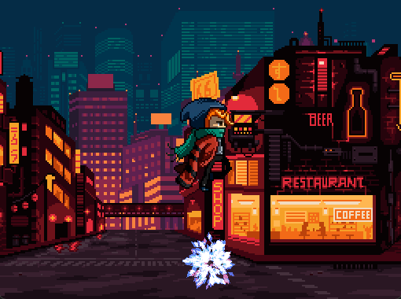

# Dapper Dasher

A side-scrolling runner game built with C++ and [Raylib](https://www.raylib.com/). Control Scarfy, the dapper character, as you run through a parallax-scrolling cityscape, avoiding animated Nebula obstacles to reach the finish line! The codebase follows (and extends) lessons from the course GameDev.tv [C++ Fundamentals: Game Programming For Beginners](https://www.udemy.com/course/cpp-fundamentals/).   



## Features

- **Smooth Parallax Scrolling**: Three-layer background system (far buildings, back buildings, foreground) creating depth
- **Animated Sprites**: 
  - Scarfy character with 6-frame running animation
  - Nebula obstacles with 8-frame animated sprites
- **Physics System**: Realistic gravity and jumping mechanics
- **Collision Detection**: Padded collision boxes for fair gameplay
- **Win/Lose Conditions**: Reach the finish line to win, or collide with obstacles to lose

## Requirements

### Dependencies
- **raylib** (v3.0.0 or compatible) - Graphics and input library
- **C++ Compiler** with C++14 support:
  - Windows: MinGW-w64 (g++)
  - Linux: GCC (g++)
  - macOS: Clang++

### System Requirements
- Windows, Linux, or macOS
- OpenGL support

## Building

### Windows (MinGW-w64)

1. Ensure raylib is installed and accessible. The Makefile expects raylib at `..\..\` relative to the project directory.

2. Update the Makefile if needed:
   - Set `RAYLIB_PATH` to your raylib installation path
   - Set `COMPILER_PATH` to your MinGW-w64 bin directory (default: `C:/raylib/w64devkit/bin`)

3. Build the project:
   ```bash
   mingw32-make
   ```

   Or specify the project name:
   ```bash
   mingw32-make PROJECT_NAME=dasher
   ```

### Linux

1. Install raylib development libraries:
   ```bash
   sudo apt-get install libraylib-dev  # Debian/Ubuntu
   # or build from source
   ```

2. Build the project:
   ```bash
   make PROJECT_NAME=dasher
   ```

### macOS

1. Install raylib via Homebrew:
   ```bash
   brew install raylib
   ```

2. Build the project:
   ```bash
   make PROJECT_NAME=dasher
   ```

### Manual Compilation

If you prefer to compile manually:

```bash
g++ -o dasher dasher.cpp -I/path/to/raylib/src -L/path/to/raylib/src -lraylib -lopengl32 -lgdi32 -lwinmm
```

(Adjust library flags for your platform: Linux uses `-lGL -lm -lpthread -ldl -lrt -lX11`, macOS uses framework flags)

## Running

### Windows
```bash
./dasher.exe
```

### Linux/macOS
```bash
./dasher
```

**Note**: Ensure the `textures/` directory is in the same directory as the executable, as the game loads textures from relative paths.

## Controls

- **SPACE** - Jump (only when on the ground)

## Gameplay

1. **Objective**: Navigate Scarfy past the Nebula obstacles to reach the finish line
2. **Jumping**: Press and hold SPACE to jump. You can only jump when on the ground
3. **Physics**: Gravity pulls Scarfy down when in the air. Time your jumps carefully!
4. **Collision**: The game uses padded collision detection, so you have a bit of leeway when avoiding obstacles
5. **Win Condition**: Reach the finish line (marked by the rightmost Nebula's position)
6. **Lose Condition**: Collide with any Nebula obstacle

## Project Structure

```
Dapper Dasher/
├── dasher.cpp          # Main game source code
├── Makefile            # Build configuration
├── README.md           # This file
├── screenshot.png      # Game screenshot
├── textures/           # Game assets
│   ├── scarfy.png              # Player character spritesheet (6 frames)
│   ├── 12_nebula_spritesheet.png  # Obstacle spritesheet (8 frames)
│   ├── far-buildings.png       # Background layer
│   ├── back-buildings.png      # Midground layer
│   └── foreground.png          # Foreground layer
└── dasher.exe          # Compiled executable (Windows)
```

## Code Structure

- **`AnimData` struct**: Manages sprite animation data (frame, position, timing)
- **`isOnGround()`**: Checks if a sprite is touching the ground
- **`updateAnimData()`**: Updates animation frames based on elapsed time
- **`drawBackground()`**: Handles parallax scrolling for background layers
- **Main game loop**: Handles input, physics, collision detection, and rendering

## Technical Details

- **Frame Rate**: 60 FPS target
- **Animation Speed**: 12 frames per second
- **Physics Constants**:
  - Gravity: 1000 pixels/second²
  - Jump Velocity: -600 pixels/second
  - Nebula Speed: -200 pixels/second
- **Parallax Speeds**:
  - Background: 20 pixels/second
  - Midground: 40 pixels/second
  - Foreground: 80 pixels/second

## License

This project uses raylib, which is licensed under the zlib/libpng license.

## Credits

- Built with [raylib](https://www.raylib.com/) - A simple and easy-to-use library to enjoy videogames programming
- Game assets from raylib examples/tutorials
